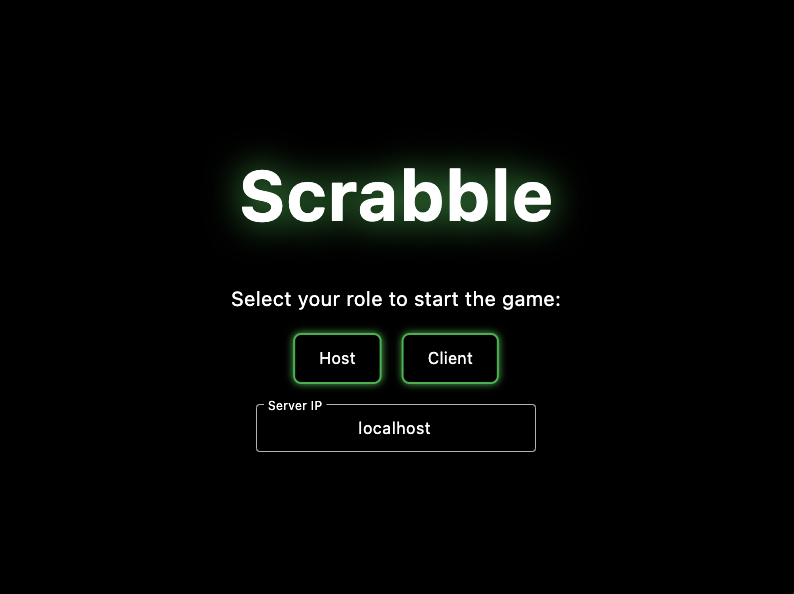
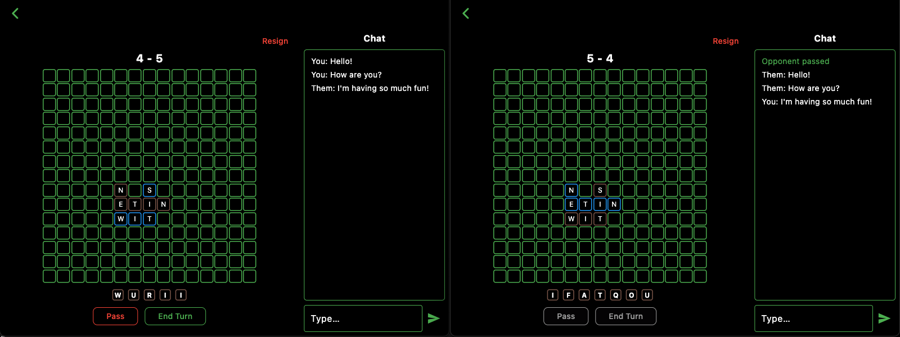

# Scrabble Multiplayer Game

A turn-based multiplayer Scrabble-like game built with Flutter and Bloc. Two players take turns placing tiles, passing, and ending turns while scores are tracked locally.




---

## Game Logic Description

- **Board**: 15×15 grid of squares.
- **Tile Bag**: Standard 100‐tile English distribution (including 2 blanks), shuffled on startup local to each client.
- **Turns**:
  - **Place Tile**: Drag a tile from your rack onto any empty square when it’s your turn.
  - **End Turn**: Once you’ve placed at least one tile, click **End Turn** (green outline/text) to draw back up to 7 tiles. The exact drawn tiles are sent to the opponent to keep each bag in sync.
  - **Pass**: Click **Pass** (red outline/text) to skip placing and immediately pass the turn without drawing.
- **Ownership & Coloring**:
  - Tiles you place are marked as **brown** on the board.
  - Opponent’s tiles appear **blue**.
- **Scoring**: Simple tile‐count score: each tile placed adds 1 point to that player’s total. Scores are maintained locally and displayed at the top.

---

## Installation & Setup

1. **Prerequisites**:
   - Flutter SDK (≥2.10)
   - Dart SDK
   - An IDE (VS Code, Android Studio) or command‐line setup
2. **Clone the Repository**:
   ```bash
   git clone https://github.com/yourusername/scrabble_game.git
   cd scrabble_game
   ```
3. **Install Dependencies**:
   ```bash
   flutter pub get
   ```

---

## Running the Game

1. **Start Two Instances**:
   - Launch on two devices/emulators.
   - On one, choose “Start New Game” (becomes Player 1).
   - On the other, choose “Join Game” (becomes Player 2); enter the host’s IP and port.
2. **Gameplay**:
   - Drag tiles from your rack onto the board.
   - Use **Pass** or **End Turn** as needed.
   - Chat with your opponent via the chat panel.

---

## Project Structure

- `lib/main.dart`: Entry point for application
- `lib/scrabble_game_state.dart`: Game logic and state management.
- `lib/scrabble_player.dart`: UI and interaction code (board, rack, controls).
- `lib/socket_state.dart`: Networking via sockets.
- `lib/message_state.dart`: Chat message management.

---
